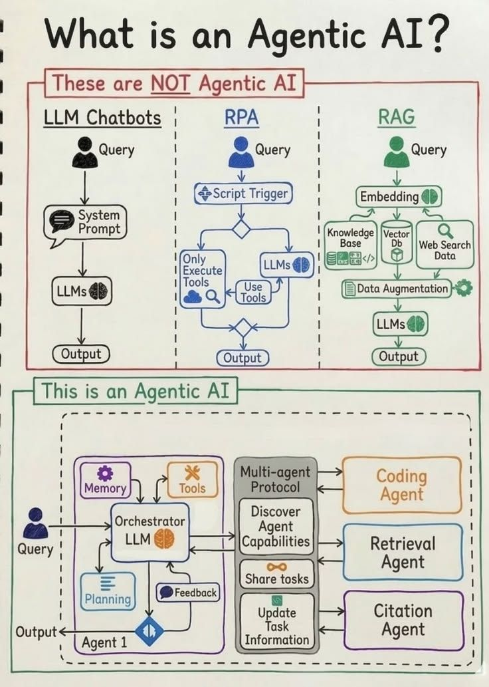

# Mutil agent from scratch overview
This repository builds a multi-agent system step by step in order to solve problems that a single agent typically faces.  
First, you need to install the full repository and its submodules using the command:  
```bash
git clone --recurse-submodules https://github.com/PhamDangNguyen/Multi-agent-from-scratch.git
```


## Proposed Architecture  

<Details>  
<summary>Repo Architecture Structure</summary>

```bash
multi-agent-system/
│
├── orchestrator/               # Center brain
│   ├── orchestrator.py         # agent
│   ├── planner.py              # planning logic
│   ├── feedback.py             # self-reflection / critic loop
│   └── state.py                # global task state
│
├── log_set/                    # logging setting 
│
├── mcp/                        # mcp setup  
│
├── skill/   
│
├── llm/                        # LLM provider init 
│   ├── provider         
│   │   ├── ....
│   ├── base.py     
│
├── agents/                     # implements agent
│   ├── base.py
│   ├── coding_agent.py
│   ├── retrieval_agent.py
│   └── citation_agent.py
│
├── tools                      # common tools
│
├── memory/                     # memory system
│   ├── short_term.py
│   ├── long_term.py
│
├── prompts/                    # prompt
│   ├── orchestrator/
│   ├── agents/
│   │   ├── coding.md
│   │   ├── retrieval.md
│   │   └── citation.md
│   │
│   ├── llm_systems/
│   │   ├── gemini.md
│   │   ├── openai.md
│
├── schemas/                    # contract IO
│   ├── task.py
│   ├── message.py
│   └── agent_output.py
│
├── workflows/                  #  concrete flow
│   ├── qa_flow.py
│   ├── coding_flow.py
│   └── research_flow.py
│
├── services/                   # API layer
│   ├── api.py
│   └── worker.py
│
├── configs/
├── utils/
├── tests/
│
├── main.py
└── README.md
```
</details>

<Details>  
<summary>Target flow</summary>

- The target flow for building an agentic AI is as follows:  

</details>

## Agents detail
### Planner Agent
Refer: [Git ai-agents-for-beginners](https://github.com/microsoft/ai-agents-for-beginners/blob/main/07-planning-design/README.md).  
- This agent must divide the main task into specific tasks and distribute them to sub-agents through an orchestrator.


### Bash Agent
Refer: [NVIDIA Nemotron Bash Agent](https://developer.nvidia.com/blog/create-your-own-bash-computer-use-agent-with-nvidia-nemotron-in-one-hour/).  
- The key part of the main task is to implement command-line operations that allow users to read or remove files and folders.
### Coding Agent 


# Prequisite
## Environment Setup 
- Install [UV](https://docs.astral.sh/uv/getting-started/installation/) or [Miniconda](https://www.anaconda.com/docs/getting-started/miniconda/install/overview) to create environments for this project. For now, I choose uv for its convenience.  


## Database setup 
**a. Qdrant DB**  
- This is the core database, which stores the agents' core knowledge base for retrieval.
```bash
cd container/database/qdrant
docker compose up --build -d
```

# Running
## Add instructions if necessary
- The [repo instruction](https://github.com/multica-ai/andrej-karpathy-skills) with 131k stars, this repository describes how a single CLAUDE.md file can improve Claude Code’s behavior. It may also apply to Codex and other coding agents. You can research it and use any parts of the file that are useful. 
## Run service
- Running following this command:
```bash
uv sync
uv run main.py
```
